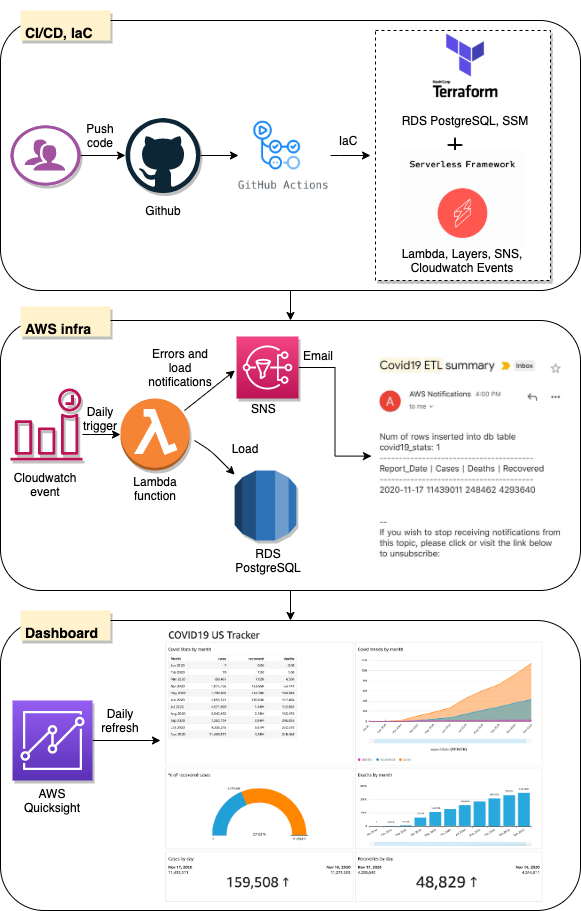

# [#CloudGuruChallenge](https://acloudguru.com/blog/engineering/cloudguruchallenge-python-aws-etl)

## Event-Driven Python on AWS

**Goal of the challenge:** Automate an ETL processing pipeline for COVID-19 data using Python and cloud services.

**Sub-tasks:**
- [x] ETL Job - Create a job that runs once a day to perform some task
- [x] Extraction - Load the data from [here](https://github.com/nytimes/covid-19-data/blob/master/us.csv?opt_id=oeu1598130766489r0.9183835738508552) CSV into an object in memory
- [x] Transformation - Perform data manipulations
    - Cleaning
    - Joining with [here](https://raw.githubusercontent.com/datasets/covid-19/master/data/time-series-19-covid-combined.csv?opt_id=oeu1598130766489r0.9183835738508552) csv
    - Filtering (to remove non-US stats)
- [x] Code cleanup - Move data manipulation into a python module
- [x] Load - Load transformed data into a DB
- [x] Notification - Notify using SNS that the ETL job is complete
- [x] Error handling
- [x] IaC - Use IaC to bring up infrastructure
- [x] Source Control - Store code in Github
- [x] Dashboard - Report the data using some visualisation/BI tool
- [x] Blog Post - Post about the experience and challenges

You can check out my blog here: https://keertisurapaneni.medium.com/cloudguruchallenge-event-driven-python-on-aws-c1adbdec19ae
Feel free to connect with me on [LinkedIn](https://www.linkedin.com/in/keerti-s-17629b74/)

Below is the architecture diagram of my pipeline:

